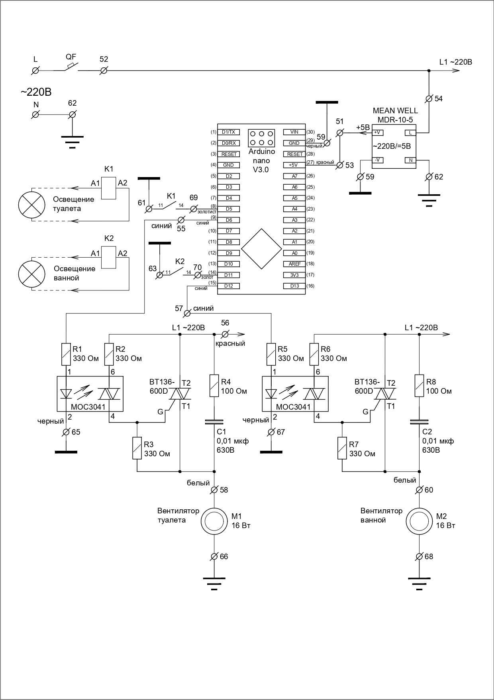

## Система вентиляции ванной комнаты и туалета моего дома
Проектная система вентиляции ванной комнаты была спроектирована неверно: в ванной комнате отсутствует прямая вентиляция типа "ванная - вентканал - улица".
Вместо этого проектировщики придумали сквозное отверстие в туалет и назвали это вентиляцией. Понятно что никакого нормального проветривания без вентилятора в таком случае быть не может. 

### Техусловия: подход к решению проблемы
1) Вентилятор должен вытягивать сырой воздух из ванной в туалет
2) Вентилятор в туалете должен работать одновременно с вентилятором ванной и транспортировать сырой воздух далее в вентсистему дома и в конечном итоге на улицу
3) Вентилятор туалета должен работать самостоятельно если возникает необходимость вентиляции туалета для удаления неприятных запахов.
4) Желательно чтобы после посещения ванной и туалетной комнат система вентиляции еще некоторое время работала для того чтобы восстановить нормальное состояние комнат

### Мое решение
1) В ванной и туалете есть свой вентилятор
2) В туалете расположена система управления вентиляторами
3) Система управления получает информацию о посещении комнат и делает вывод о необходимости включения вентиляторов по наличию освещения данных комнат - если освещение включено значит в комнате кто-то есть, запускается алгоритм оценки дальнейших действий системы управления вентиляторами

### Алгоритм работы системы управления
- Вентилятор в ванной включается через 2 минуты после включения освещения в ванной
- Вентилятор в туалете тоже работает, если работает вентилятор ванной
- Вентилятор ванной выключается по истечении 20 минут с момента отключения освещения
- Вентилятор туалета должен отключиться одновременно с вентилятором ванной, если не активна программа вентиляции самого туалета
- Программа вентиляции туалета активируется после 2 минут невыключения освещения в туалете
- Программа вентиляции туалета завершается по истечении 5 минут после отключения света в туалете, после чего вентилятор туалета отключается - если не активна программа вентиляции ванной  

### Техническая реализация

